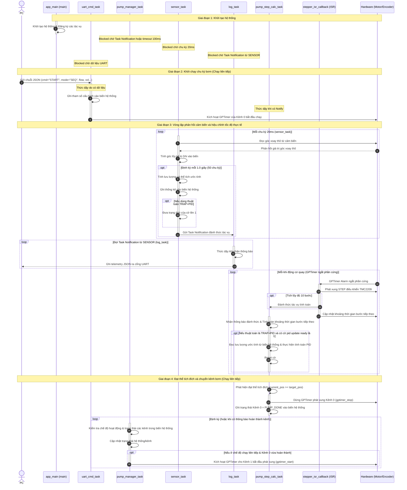

# Biểu đồ Sequence và Phân tích tương tác giữa các Tác vụ (Tasks) - Đã thêm hộp kích hoạt (Activation Boxes)

Tài liệu này mô tả chi tiết biểu đồ sequence của hệ thống điều khiển bơm tiêm kép (**Dual Syringe Pump**). Bản cập nhật này bổ sung các hộp kích hoạt màu chữ nhật đứng (Activation Boxes) trên đường sống (lifeline) của mỗi tác vụ để biểu thị rõ thời điểm tác vụ thức dậy và xử lý công việc.

---

## 1. Cơ chế Điều phối Kênh của `pump_manager_task`

Theo thiết kế hệ thống và sửa đổi mới nhất:
1.  **Độc lập kiểm tra chế độ**: Tác vụ `pump_manager_task` (`MGR`) chịu trách nhiệm duy nhất trong việc kiểm tra chế độ hoạt động (`op_mode`) và điều phối trạng thái hệ thống. Tác vụ tính toán bước (`CALC`) chỉ thực hiện nhiệm vụ điều khiển động cơ của riêng nó và cập nhật trạng thái kênh của nó thành `PUMP_DONE` trong bộ nhớ chung.
2.  **Đọc và ghi bộ nhớ chung (Shared Memory)**: `MGR` tự động kiểm tra trạng thái của các kênh và chế độ hoạt động thông qua cấu trúc `system_state_t` (sử dụng `sys_state_mutex`). Nó tự cập nhật lại dữ liệu (ví dụ: chuyển đổi trạng thái hệ thống chạy/dừng) mà không cần giao tiếp trực tiếp với tác vụ tính toán.
3.  **Tương tác phần cứng**: Nếu chế độ hoạt động yêu cầu kích hoạt kênh tiếp theo (như chế độ chạy tuần tự `Sequential` chuyển từ Kênh 0 sang Kênh 1), `MGR` sẽ trực tiếp gửi lệnh khởi động timer tới phần cứng (`HW`).

---

## 2. Biểu đồ Sequence của Hệ thống

